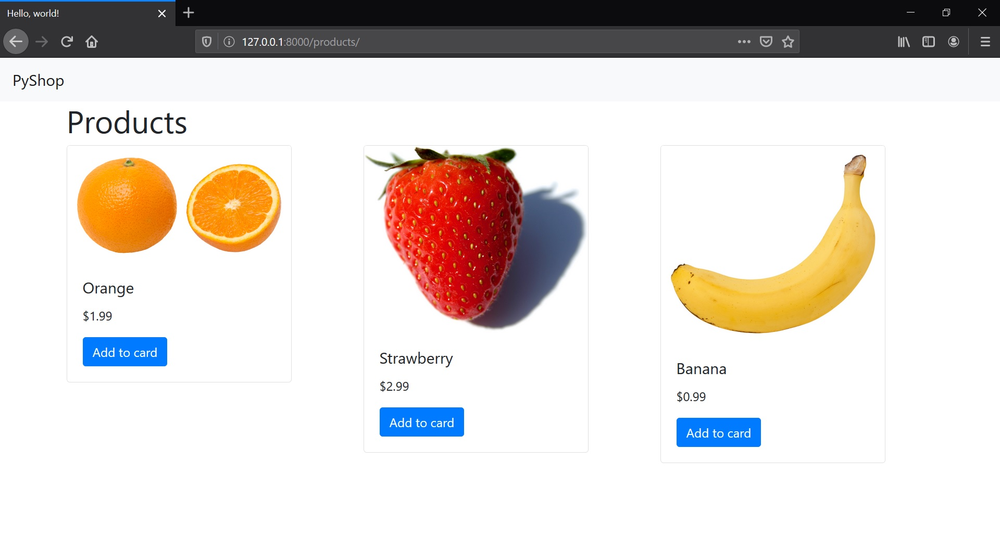

## Simple Django Project
created by the tutorial:  
[Python Tutorial for Beginners [Full Course] Learn Python for Web Development](https://www.youtube.com/watch?v=_uQrJ0TkZlc)

###### Steps to launch the app  
- Install Django
```
pip install django
```
- Install django-import-export
```
pip install django-import-export
```
- Run the app
```
py manage.py runserver
```
- Create db structure
```
py manage.py makemigrations
py manage.py migrate
```
- Create user for admin panel
```
py manage.py createsuperuser
```
- Go to http://127.0.0.1:8000/admin/products/product/
- Add new products (manually or using export for [Products.csv](Products.csv))
- Visit http://127.0.0.1:8000/products/

---  
###### Other useful info

* Create a Django project
```
django-admin startproject pyshop .
```
* Create an app
```
py manage.py startapp products
```
